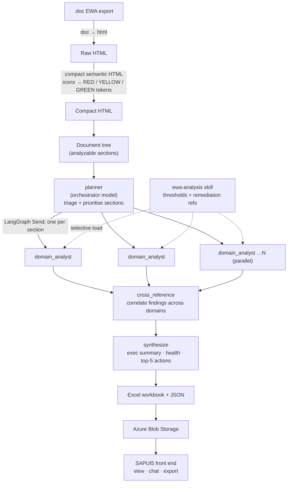

# EWA Analyzer

**Turn a 100-page SAP EarlyWatch Alert report into a prioritised, evidence-linked action list — in minutes, for a few cents.**

EWA Analyzer ingests SAP EarlyWatch Alert (EWA) exports, runs them through a multi-agent AI pipeline built on **LangGraph**, and produces a structured analysis: findings with severity, evidence, and Basis remediation steps, cross-domain risk correlations, an executive summary, and a downloadable Excel workbook. It runs on Azure (Container Apps + Blob Storage + Azure OpenAI) with a SAPUI5 front end.

---

## The problem it solves

SAP EarlyWatch Alert reports are the standard health check for a productive SAP system — but they are long, dense, and heavy on tables and traffic-light icons. Across a managed-services estate with dozens of systems, a human reviewing each one every week is slow, inconsistent, and easy to skim. Two engineers reading the same report often surface different findings.

EWA Analyzer makes that review **fast, consistent, and repeatable**. Every report is analysed the same way, every finding is tied back to the evidence in the source document, and every recommendation points at concrete SAP transactions. Because the pipeline tracks token cost per phase, the price of each analysis is known and auditable.

---

## How it works

The system has two halves: a **domain-specific ingestion step** that makes an EWA report cheap for a language model to read, and a **coordinator-worker agent graph** that does the analysis.



### 1. Ingestion — making an EWA report LLM-friendly

An EWA export is a Word document full of styling and status **icons**. Feeding that to a model raw is expensive and noisy. The ingestion step does two useful things:

- **Compact semantic HTML.** The document is converted `.doc → HTML → compact HTML`, stripping presentation while keeping structure (headings, tables, sections). This cuts token count dramatically.
- **Icon tokenization.** EWA relies on red/yellow/green status icons to signal health. An `icon_classifier` turns those images into text tokens — `[RED]`, `[YELLOW]`, `[GREEN]` — so the model can read a status it would otherwise be blind to.

The compact document is then parsed into a **tree** and split into *analyzable sections*.

### 2. Analysis — a LangGraph coordinator-worker graph

The analysis is a small team of AI agents rather than one giant prompt. LangGraph (a framework for building stateful, multi-step agent workflows as a graph) wires them together:

| Node | Model tier | Role |
|---|---|---|
| `planner` | Orchestrator (most capable) | Reads the tree, prioritises sections, and hands each analyst a focus hint and the relevant skill references. |
| `domain_analyst` ×N | Specialist (faster / cheaper) | Runs **in parallel**, one invocation per section. Produces structured findings — severity, evidence, impact, remediation. |
| `cross_reference` | Orchestrator | Correlates findings across sections to surface compound risks a single-section view would miss. |
| `synthesize` | Orchestrator | Writes the executive summary, overall system health, and top-5 priority actions. |

The parallel fan-out (LangGraph's `Send` primitive) is what keeps a large report fast: sections are analysed concurrently, not one after another. Every node writes **structured output** (Pydantic schemas), so findings are machine-parseable rather than free text.

### 3. The skills system — curated Basis knowledge, loaded on demand

The quality of each finding depends on the model knowing *what "good" looks like* for an SAP system. That expertise lives in a filesystem **skill** at `backend/skills/ewa-analysis/`, split into reference files:

- `thresholds-*` — memory, database, performance, batch, security, operations thresholds.
- `remediation-*` — matching Basis remediation playbooks.
- `correlations` — cross-domain compound-risk patterns.

Rather than dumping all of this into every prompt, the planner and analysts **selectively load only the references a section needs** (progressive disclosure). A memory section pulls the memory thresholds and playbook; a security section pulls the security ones. This keeps prompts focused and cheap while encoding real SAP Basis expertise as retrievable context.

### 4. Output and storage

The final result is written as a formatted **Excel workbook** plus JSON artifacts, all persisted to **Azure Blob Storage** — there is no database. Blob storage is the single source of truth, so container restarts and scale-to-zero events do not lose data. The SAPUI5 front end lists, views, and exports analyses, and includes a **chat** feature for asking follow-up questions grounded in the analysed report.

---

## Tech stack

| Layer | Technology |
|---|---|
| Agent orchestration | LangGraph (coordinator-worker graph, parallel `Send` fan-out) |
| Model inference | Azure OpenAI (default) or Anthropic-on-Azure; orchestrator / specialist / router tiers |
| Backend API | FastAPI (Python 3.12+) |
| Frontend | SAPUI5 |
| Storage | Azure Blob Storage (uploads, compact HTML, analysis JSON, Excel) |
| Structured output | Pydantic schemas via `with_structured_output` |
| Hosting | Azure Container Apps (single combined image) |
| Auth | Microsoft Entra ID (platform headers or JWT bearer) |
| Cost control | Per-phase token + cost tracking |

---

## Repository structure

| Path | Contents |
|---|---|
| `backend/ewa_pipeline/` | The analysis pipeline: agents (`orchestrator`, `runner`, `skill_loader`), indexer, report/Excel generation, cost tracking. |
| `backend/converters/` | `.doc` → HTML → compact semantic HTML, plus the icon classifier. |
| `backend/skills/ewa-analysis/` | Curated SAP Basis thresholds and remediation references. |
| `backend/routers/` | FastAPI routes: storage, AI, chat, export, auth, health. |
| `sapui5/` | SAPUI5 front end and build config. |
| `docs/` | Runtime architecture and Azure migration guide. |
| `deployment/` | Deployment instructions and environment notes. |
| `samples/` | Example EWA export and extracted HTML for local testing. |

---

## Getting started (local)

**Prerequisites:** Python 3.12+, Node.js 20+, Docker (optional), and Azure resources (Blob Storage + a model endpoint) for a full run.

### Backend

```powershell
cd backend
python -m venv .venv
.\.venv\Scripts\Activate.ps1
pip install -r requirements.txt

Copy-Item ..\.env.example .env   # then fill in real values locally
python ewa_main.py
```

The API serves on `http://localhost:8001`.

### Frontend

```powershell
cd sapui5
npm install
npm start
```

The SAPUI5 app serves on `http://localhost:8080` and, in local mode, calls the backend on `http://localhost:8001`.

### Run the pipeline directly (CLI)

The pipeline can be run without the UI — useful for testing or batch analysis:

```powershell
cd backend
python -m ewa_pipeline analyze --doc ..\samples\<report>.doc --output output\analysis.xlsx
```

---

## Configuration

All configuration is via environment variables — see `.env.example` for the full list. The essentials:

| Variable | Purpose |
|---|---|
| `AZURE_STORAGE_CONNECTION_STRING` | Blob Storage access (prefer Key Vault / platform secrets). |
| `AZURE_STORAGE_CONTAINER_NAME` | Blob container for uploads and outputs. |
| `PROVIDER` | `openai` or `anthropic`. |
| `AZURE_OPENAI_ENDPOINT` / `AZURE_OPENAI_API_KEY` / `AZURE_OPENAI_API_VERSION` | Model endpoint and credentials. |
| `V2_ORCHESTRATOR_MODEL` | Deployment for planner, cross-reference, and synthesis (most capable). |
| `V2_SPECIALIST_MODEL` | Deployment for the parallel domain analysts (faster / cheaper). |
| `V2_ROUTER_MODEL` | Deployment for routing, page indexing, and chat retrieval (fastest). |
| `AUTH_ENABLED` / `TRUST_PLATFORM_AUTH_HEADERS` | Entra authentication behaviour in hosted environments. |

> **Never commit real keys or connection strings.** Store secrets in Azure Container App settings, Key Vault, or a CI/CD secret store.

---

## Deployment

The recommended shape is a **single combined image** (`Dockerfile.containerapp`) on **Azure Container Apps**: FastAPI serves the built SAPUI5 assets from the same origin, backed by one Blob Storage account and one Azure OpenAI resource, with Entra ID authentication enabled on the Container App.

Notes:
- Analysis requests can take minutes — keep ingress and client timeouts high enough for interactive runs.
- With `CORS_ALLOWED_ORIGINS` unset in production, the backend allows same-origin requests only.
- Blob Storage is the only persistent store; a misconfigured container name will break uploads and retrieval.

See `docs/RUNTIME_ARCHITECTURE.md` and `docs/AZURE_MIGRATION_GUIDE.md` for the full runbook.

---

## Documentation

- **`docs/RUNTIME_ARCHITECTURE.md`** — runtime components, model tiers, and known deployment risks.
- **`docs/AZURE_MIGRATION_GUIDE.md`** — Azure provisioning and deployment runbook.
